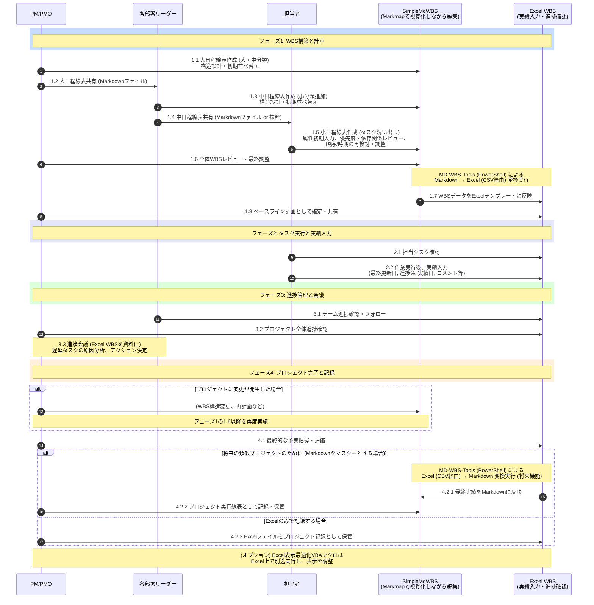

# Excel WBS/ガントチャートテンプレート 仕様書 Ver. 0.3（2025-06-03）<-- バージョン更新

## 1. はじめに

本仕様書は、MD-WBS-Toolsプロジェクトと連携して使用されるExcel WBS/ガントチャートテンプレート（`samples/excel_templates/simple-markdown-wbs-gantt-template.xlsx` を想定）の構造、主要な列定義、入力ルール、および計算ロジックについて定義します。
PowerShellスクリプト（`Convert-SimpleMdWbsToCsv.ps1`）は、このテンプレート仕様に適合するCSVファイルを出力します。

## 2. テンプレート全体の構成と操作セル

### 2.1. 主要な操作セル

以下のセルは、テンプレート全体の表示や計算に影響を与える重要な操作セルです。

* **E1セル: プロジェクト名（案件名）**
  * 内容: プロジェクトの名称を入力します。
  * 連携: `simple-md-wbs` のH1見出し（プロジェクト名）からCSV経由で設定されることを想定。
* **P1セル: 開始日（プロジェクト開始日）**
  * 内容: プロジェクト全体の開始日をYYYY-MM-DD形式で入力します。
  * 連携: ガントチャートの描画開始時期の基準となります。ユーザーがExcelテンプレート上で直接設定します。
* **P2セル: 基準日**
  * 内容: 進捗状況を評価するための基準日。通常は `=TODAY()` 関数が設定されています。
  * 連携: ガントチャートの「今日線」の表示、タスクの遅延計算などに使用されます。
* **P3セル: 週表示**
  * 内容: ガントチャート領域の表示開始位置を調整するためのオフセット値（単位：週）。
    * `0`: プロジェクト開始日（P1）が含まれる週の月曜日から表示。
    * `-1`: プロジェクト開始日（P1）の前の週の月曜日から表示。
  * 連携: ガントチャートの日付行の最初のセル（例: AB3セル）の日付計算に影響します。

### 2.2. 列のグループ化と主要表示列

本テンプレートは、情報量が多くなることと視認性への配慮から、一部の列がグループ化され、通常は主要な列のみが表示されるように設計されています。

* **F列, G列, H列のグループ化:**（関連タスク情報）
  * **F列: 先行有無**（CSVから入力orExcel数式）
  * **G列: 関連番号（先行タスクID）**（CSVから入力）
  * **H列: 先行後続タスク名**（CSVから入力）
  * **I列: 関連タスク有無表示**（主要表示列）
    * 内容: G列に関連タスクIDが設定されていれば "○" などを表示。（Excelでは関連タスクIDの調査は行っていない）
    * **計算式（I5セル）: `=IF(ISBLANK(G5),"","○")`**

* **J列, K列, L列, M列のグループ化:**（遅延計算関連）
  * **J列: アクションプラン**（ユーザー入力欄）
    * 内容: タスクに関する具体的なアクションやメモを自由記述。
    * `simple-md-wbs`属性:「コメント」属性の主要な入力元/出力先。
  * **K列:（計算用 遅延影響評価など）**
    * **計算式（K5セル）: `=IF($Z5<>"",IF($W5>=$Z5,$W5-$Z5,$X5)*$Y5,0)`**
      * 依存列: W5（終了計画）、X5（日数計画）。**Y5, Z5 がCSVのどの列/ `simple-md-wbs` のどの属性に対応するか、またはExcel内での手入力/別計算なのか明確化が必要。**（例: Y5=進捗率、Z5=実績終了日）
  * **L列:（計算用 遅延日数1）**
    * **計算式（L5セル）: `=IF($K5>0,IF($Z5<>"",IF((IFERROR($Z5,P$1)+$K5)<P$2,P$2-($Z5+$K5),0),0),0)`**
  * **M列:（計算用 遅延日数2）**
    * **計算式（M5セル）: `=IF(AND(IFERROR(VALUE($X5),0),$Z5="",$V5<P$2),P$2-$V5,0)`**
  * **N列: 遅延日数表示**（主要表示列）
    * 内容: L列とM列の最大値を表示。
    * **計算式（N5セル）: `=MAX(L5:M5)`**

* **Q列のグループ化:**（最終更新日）
  * **Q列: 最終更新（日）**（主要表示列、かつユーザー入力欄）
    * 内容: タスク担当者が情報を更新した日付をYYYY-MM-DD形式で**手入力**します。
    * `simple-md-wbs`属性:「最終更新日」属性に対応。

### 2.3. 行のグループ化（VBAマクロによる表示最適化）

Excelは、WBSの進捗管理やガントチャート表示、チーム内でのデータ共有に広く利用されています。本テンプレートも、そのような用途を想定し、標準順序CSVファイルを読み込んで活用することを前提としています。しかし、WBSの規模が大きくなるにつれて、Excelシート内の行数が膨大になり、全体像を把握することが難しくなる場合があります。そこで、本テンプレートでは、行のグループ化による表示最適化を検討しています。

Excelの組み込み機能である「グループ化」を活用すると、任意の行範囲を折りたたんで集約行（サマリー行）のみを表示させることができます。しかし、手動で多数のグループを設定するのは手間がかかります。

そこで、本プロジェクトではオプションとして、**「Excel表示最適化VBAマクロ」**の提供を検討しています。このVBAマクロは、以下の目的で利用されることを想定しています。

1. **表示順序の変更（グループ化の準備）:**
    * PowerShellスクリプトが出力した「標準順序CSV」をExcelで開いた後、このVBAマクロを実行します。
    * 各カテゴリ行（大分類、中分類、小分類）がある。マクロは、それを構成するタスク行や下位カテゴリ行の**後（見た目上は下）**に来るように、行の並べ替えを試みます。
    * この並べ替えは、A列の「番号（タスクID）」やアイテムの階層情報を解析し、Excelのソート機能や行の挿入・移動をVBAで制御することによって実現されます。
    * これにより、Excelのグループ化機能で、カテゴリ行をクリックした際にそのカテゴリに属するタスクや下位カテゴリが展開/折りたたみされる、より直感的な操作が可能になります。

2. **自動グループ設定（検討事項）:**
    * 並べ替え後のデータに対して、VBAマクロが自動的にExcelの「グループとアウトラインの設定」を行うことも検討可能です。これにより、ユーザーは手動でグループを設定する手間が省けます。

3. **標準順序への復元:**
    * Excelで特殊な表示順序にしたデータは、VBAマクロを利用しない環境では正しく表示・編集できない可能性があります。また、将来的にCSV→`simple-md-wbs`変換機能を利用する場合や、他のツールとの連携を考慮すると、「標準順序」に戻せる機能は非常に重要です。別のVBAマクロ（または同じマクロの別機能）を実行し、行の順序を「標準順序（カテゴリが先、タスクが後）」に戻してからCSVとして保存する必要があります。

**VBAマクロの提供形態（検討事項）:**

VBAマクロの提供形態としては、以下のいずれかを検討しています。

* **マクロを組み込んだExcelテンプレート:** もっとも手軽に利用できますが、セキュリティ設定によってはマクロが実行できない場合があります。
* **Excelアドイン:** より安全にマクロを利用できますが、インストール作業が必要です。
* **VBAスクリプトファイル:** ユーザーが自身でExcelにマクロを組み込む必要がありますが、柔軟性が高いです。

**現時点での注意点:**

* このVBAマクロは**オプション機能**であり、開発はPowerShellスクリプトによるCSV入出力機能の安定化後となります。
* VBAマクロの詳細な仕様（IDの一時的な書き換えルール、ソートキーの利用方法、エラーハンドリングなど）は、別途VBAマクロの設計段階で定義されます。
* ユーザーは、マクロの実行許可やセキュリティ設定について、ご自身のExcel環境に合わせて適切に設定する必要があります。
* VBAマクロは将来的な作成する予定です。それまでの間は、Excelの「グループ化」機能、フィルタリング機能、並べ替え機能などを活用して、表示を最適化できます。
* **VBAマクロの利用は、Excelファイルの破損やデータ損失のリスクを伴う可能性があります。VBAマクロを実行する前に、必ずファイルのバックアップを作成してください。**
* **本VBAマクロは、Excelのバージョンや環境に依存する可能性があります。すべての環境での動作を保証するものではありません。**

PowerShellスクリプトは、あくまで論理的な構造を持つ「標準順序CSV」の生成・解釈に責任を持ちます。Excel上での表示の最適化や特殊な並べ替えは、このオプションのVBAマクロ、またはユーザー自身によるExcel操作によって行われるという役割分担になります。

## 3. 主要なWBSデータ列定義と計算ロジック

PowerShellスクリプトから出力されるCSVは、以下の列（またはこれに準ずる列）にデータを持ちます。
S列、T列、U列はユーザーが直接入力（さらにははCSVからインポート）する主要なデータ項目です。
V列、W列、X列は、S,T,U列の入力に基づいてExcelの計算式によって自動的に計算される計画値です。

### 3.1. ヘルパー列（非表示推奨）

* **JG列: S列が平日かの判定**
  * 式（JG5セル）: `=IF(ISBLANK(S5),"",IF(OR(WEEKDAY(S5,2)=6,WEEKDAY(S5,2)=7),FALSE,TRUE))`
* **JH列: T列が平日かの判定**
  * 式（JH5セル）: `=IF(ISBLANK(T5),"",IF(OR(WEEKDAY(T5,2)=6,WEEKDAY(T5,2)=7),FALSE,TRUE))`

### 3.2. 入力列（S, T, U）- CSVからの主要入力元 / ユーザー直接入力

* **S列: 開始入力**
  * 内容: タスクの開始予定日（ユーザー入力またはCSVから）。YYYY-MM-DD形式。
  * `simple-md-wbs`属性:「開始日（入力）」属性に対応。
* **T列: 終了入力**
  * 内容: タスクの終了予定日（ユーザー入力またはCSVから）。YYYY-MM-DD形式。
  * `simple-md-wbs`属性:「終了日（入力）」属性に対応。
* **U列: 日数入力**
  * 内容: タスクの所要見積日数（ユーザー入力またはCSVから）。数値。
    * **V列・W列の計算においては「実働日数（土日を含まない）」として主に解釈される。**
    * **X列の計算においては、S列・T列が土日にかかる場合はカレンダー日数として解釈される場合がある。**
  * `simple-md-wbs`属性:「日数（入力）」属性に対応。

### 3.3. 計画列（V, W, X）- Excel計算式による自動計算

* **V列: 開始計画**
  * **式（V5セル）: `=IF(NOT(ISBLANK(S5)),S5,IF(AND(NOT(ISBLANK(T5)),NOT(ISBLANK(U5))),IF(NOT(JH5),T5-U5+1,WORKDAY.INTL(T5,-U5+1,1)),""))`**
* **W列: 終了計画**
  * **式（W5セル）: `=IF(NOT(ISBLANK(T5)),T5,IF(AND(NOT(ISBLANK(S5)),NOT(ISBLANK(U5))),IF(NOT(JG5),S5+U5-1,WORKDAY.INTL(S5,U5-1,1)),""))`**
* **X列: 日数計画**
  * **式（X5セル）: `=IF(NOT(ISBLANK(U5)),U5,IF(AND(NOT(ISBLANK(S5)),NOT(ISBLANK(T5))),IF(S5<=T5,IF(OR(NOT(JG5),NOT(JH5)),T5-S5+1,NETWORKDAYS.INTL(S5,T5,1)),0),""))`**

### 3.4. その他の主要データ列と `simple-md-wbs` 属性のマッピング

PowerShellスクリプト（`Convert-SimpleMdWbsToCsv.ps1`）は、以下の情報をCSVファイルに出力します。Excelテンプレートの対応する列にこれらのデータがインポート（または貼り付け）されることを想定しています。
Excel側の数式で計算される列（V,W,X,I,K,L,M,N列など）は、CSVには計算結果ではなく、計算の元となる `simple-md-wbs` の属性値、もしくはツールが生成した基本情報が出力されます。

| Excel列（想定）| CSV列ヘッダー（推奨） | `simple-md-wbs` 属性 / ツール生成情報                   | 備考 |
|----------------|-----------------------|---------------------------------------------------------|------|
| A             | 番号                    |（ツール自動生成: 表示用ソートキー）                    | Excelでのソート用 |
| B             | 大分類                  | H2見出しテキスト       | |
| C             | 中分類                  | H3見出しテキスト       | |
| D             | 小分類                  | H4見出しテキスト       | |
| E             | タスクアイテム          | リストアイテムテキスト | |
| F             | 関連種別                | 「関連タスク種別」属性 | "先行", "後続" など |
| G             | 関連番号                |（解決済みの先行タスクの表示用ソートキー）              | |
| H             | 関連タスクアイテム      |（解決済みの先行タスクの名称）                          | |
| I             | 関連有無                |（Excel数式: `=IF(ISBLANK(G5),"","○")` など）| CSVには直接データなし（空欄）|
| J             | コメント                | 「コメント」属性       | Excelでは「アクションプラン」|
| K             | 進捗日数                |（Excel数式）           | CSVには直接データなし（空欄）|
| L             | 作業遅延                |（Excel数式）           | CSVには直接データなし（空欄）|
| M             | 開始遅延                |（Excel数式）           | CSVには直接データなし（空欄）|
| N             | 遅延日数                |（Excel数式: `=MAX(L5:M5)`）                            | CSVには直接データなし（空欄）|
| O             | 担当組織                | 「担当組織」属性       | |
| P             | 担当者名                | 「担当者」属性         | |
| Q             | フラグ                  |（Excelユーザー定義）   | CSVには直接データなし（空欄）|
| R             | 最終更新                | 「最終更新日」属性     | |
| S             | 開始入力                | 「開始日（入力）」属性 | |
| T             | 終了入力                | 「終了日（入力）」属性 | |
| U             | 日数入力                | 「日数（入力）」属性   | |
| V             | 開始計画                |（Excel数式）           | CSVには直接データなし（S,T,U列の値から計算）|
| W             | 終了計画                |（Excel数式）           | CSVには直接データなし（S,T,U列の値から計算）|
| X             | 日数計画                |（Excel数式）           | CSVには直接データなし（S,T,U列の値から計算、またはU列の値をそのまま表示）|
| Y             | 進捗実績                | 「進捗率」属性         | パーセント表記文字列 |
| Z             | 開始実績                | 「開始日（実績）」属性 | |
| AA            | 修了実績                | 「終了日（実績）」属性 | YYYY-MM-DD形式  |
| JG            | 開始入力は平日？        |（Excel数式 ヘルパー列）| CSVには直接データなし（空欄）|
| JH            | 終了入力は平日？        |（Excel数式 ヘルパー列）| CSVには直接データなし（空欄）|
|（デバッグ用1）| ユーザー記述ID_元       | 「ユーザー記述ID」属性 |（Excelテンプレート上では非表示または削除してよい）|
|（デバッグ用2）| 関連タスク種別_元       | 「関連タスク種別」属性 |（同上）|
|（デバッグ用3）| 関連タスクID_元         | 「関連タスクID」属性   |（同上）|
|（デバッグ用4）| アイテム種別_デバッグ用 |（ツール内部判定）      |（同上）|

## 4. 推奨される運用方法 (複数役割連携モデル)

本Excelテンプレートと `simple-md-wbs` および関連ツールは、プロジェクトに関わる多様な役割を持つメンバー間の情報共有と連携を促進する「共通言語」として機能することを目指しています。以下に、各役割の視点を交えた推奨される運用フローを示します。

### 4.1. プロジェクト計画とWBS構築 (PM, PMO, 各部署リーダー主導)

1. **トップダウンでの計画骨子作成 (PM, PMO):**
    * PMおよびPMOは、プロジェクト全体の目標、主要な成果物、マイルストーンを定義し、大日程線表（大分類・中分類レベル）の骨子を `simple-md-wbs` **またはExcel** で作成します。Excelを使用する場合、既存のテンプレートを流用したり、ガントチャートを視覚的に確認しながら計画を立てることができます。
    * この段階では、大まかな期間、主要な依存関係、責任部署（担当組織レベル）などを設定します。VS CodeとMarkmapを活用し、全体構造を視覚的に確認しながら進めます。
2. **ボトムアップでの詳細化とレビュー (各部署リーダー, 担当者):**
    * PMOは、上記で作成された `simple-md-wbs` の骨子（またはCSVに変換したもの）を各関連部署のリーダーに共有します。
    * 各部署リーダーは、自身の担当範囲（中分類・小分類）について、担当者と協力して具体的なタスクアイテムを洗い出し、必要な属性（担当者、見積日数、先行タスクなど）を `simple-md-wbs` に追記・詳細化します。
        * この際、個々のタスクは担当者がリストアップし、リーダーがそれをレビュー・承認する形が考えられます。
    * `simple-md-wbs` のテキストベースの特性は、複数人での分担作業やマージ（Git等を利用する場合）と親和性があります。
3. **WBS全体の統合とベースライン設定 (PMO, PM):**
    * 各部署から提出された `simple-md-wbs` の詳細情報をPMOが統合し、全体の整合性（依存関係の矛盾、リソースの重複など）を確認します。
    * `Convert-SimpleMdWbsToCsv.ps1` を使用して最新のWBSをCSVに変換し、Excelテンプレートに反映させます。
    * Excel上で計画日付・日数などが自動計算された結果を元に、PMがプロジェクト全体のスケジュールとクリティカルパスをレビューし、ベースラインとして承認します。
    * 承認されたWBS情報（CSVまたは`simple-md-wbs`）が、以降の進捗管理の基準となります。
    * **複数人でExcelファイルを共有する場合、ファイル名に日付やバージョン番号を入れる、SharePointやOneDriveなどのファイル共有サービスを活用するなどの方法で、バージョン管理を徹底してください。**

### 4.2. タスク実行と進捗報告 (担当者, 各部署リーダー)

1. **担当タスクの確認と実行 (担当者):**
    * 担当者は、Excelテンプレート（またはその一部抜粋）で自身の担当タスク、期間、先行タスクなどを確認し、作業に着手します。
2. **日々の進捗入力と情報更新 (担当者):**
    * 担当者は、日々の作業進捗に基づき、Excelテンプレートの自身のタスク行に対して以下の情報を**手入力で更新**します。
        * **R列「最終更新」:** 情報を更新した日付。
        * **Y列「進捗実績」:** 主観的な進捗率。
        * **Z列「開始実績」:** タスクを開始した日付。
        * **AA列「修了実績」:** タスクを完了した日付。
        * **J列「コメント（アクションプラン）」:** 遅延理由、課題、次のアクションなどを具体的に記述。
    * **進捗情報の入力頻度（毎日、毎週など）や粒度（タスクごと、フェーズごとなど）は、プロジェクトの規模や特性に応じて柔軟に決定してください。**
3. **進捗状況の集約と確認 (各部署リーダー):**
    * 各部署リーダーは、担当チームメンバーの進捗入力状況を定期的に確認・集約します。
    * Excelのフィルター機能やN列「遅延日数」などを活用し、遅延タスクや問題のあるタスクを早期に特定します。

### 4.3. プロジェクト全体の進捗管理と再計画 (PMO, PM)

1. **進捗データの収集と分析 (PMO):**
    * PMOは、各所から更新されたExcelデータ（またはCSV）を収集し、プロジェクト全体の進捗状況を分析します。
    * N列「遅延日数」や各タスクの「進捗実績」「最終更新（日）」などを元に、遅延状況、課題の傾向を把握します。
2. **進捗会議での情報共有と意思決定 (PM, PMO, 各部署リーダー):**
    * 進捗会議では、更新されたExcel WBS（必要に応じてVBAマクロで表示順を最適化したもの）を共通資料として使用します。
    * R列「最終更新」が古いタスクや、N列「遅延日数」が大きいタスクにフォーカスし、状況確認と対策を議論します。
3. **WBSの大幅な変更・再計画時の対応:**
    * **構造変更は `simple-md-wbs` で (PMO主導、各リーダー協力):**
        * 計画変更に伴うタスクの追加・削除、カテゴリの再編などは、Excelでの直接編集による書式崩れリスクを避けるため、PMOがマスターとなる `simple-md-wbs` ファイルを更新します。各部署リーダーは変更箇所に関する情報を提供します。
    * **(将来機能) Excelでの実績を `simple-md-wbs` へ反映:**
        * 日常の進捗更新（日付、進捗率、コメントなど）を `simple-md-wbs` に反映させたい場合、まずExcelのデータを「標準順序CSV」で保存します（VBAマクロで並び替えていた場合は標準順序に戻す）。
        * その後、`Convert-CsvToSimpleMdWbs.ps1`（将来開発）を実行し、CSVから `simple-md-wbs` を更新します。
    * **再計画後の展開:** 更新された `simple-md-wbs` から再度CSVを生成し、関係者に共有します。

### 4.4. 各役割にとっての `simple-md-wbs` とツールの価値

* **PM/PMO:**
  * プロジェクト全体の構造をトップダウンで設計・視覚化（Markmap連携）。
  * 各部署からの情報を統合し、一貫性のあるWBSを維持。
  * Excelテンプレートへのデータ供給源として、正確な計画情報を展開。
* **各部署リーダー:**
  * 担当範囲のWBSを詳細化し、メンバーにタスクを割り当て。
  * `simple-md-wbs` またはCSVで担当部分の構造を容易に把握・編集。
  * チーム内の進捗状況をExcelで効率的に確認。
* **担当者:**
  * 主にExcel上で自身のタスク内容、期日、進捗状況を明確に把握し、実績を入力。
  *（もし直接編集する場合）`simple-md-wbs` で自身のタスクリストを確認・更新（テキストベースでの軽微な修正など）。

**補足情報:**

* **Excelの操作に不慣れなメンバーがいる場合を考慮する。その場合は、Excelの基本操作（フィルタリング、並べ替え、入力規則など）に関する説明資料を提示する。もしくは、Microsoftの公式ドキュメントなどを参考にしてください。**
* **VBAマクロを利用する場合、セキュリティ設定だけでなく、マクロの実行時間やファイルサイズにも注意してください。大規模なWBSの場合、マクロの実行に時間がかかる場合があります。また、ファイルサイズが大きすぎると、Excelの動作が遅くなる場合があります。**
* **CSVファイルの文字コードは、Excelで正しく表示されるように、UTF-8（BOM付き）またはShift-JISを選択してください。**

この運用フローにより、各役割が必要な情報にアクセスしやすく、かつWBS情報の一貫性を保ちながら、プロジェクトを推進することを目指します。`simple-md-wbs` が計画と構造の「正」となり、Excelがその実績管理と多様なビューを提供するという役割分担です。

## 5. 改訂履歴

| バージョン | 日付       | 変更者      | 変更内容                                                                                       |
|------------|------------|-------------|------------------------------------------------------------------------------------------------|
| 0.3        | 2025-06-03 | IT Legacy   | `simple-md-wbs`の新属性順序を反映。提供されたExcel計算式を詳細化。コントロールセル情報を追加。 |
| 0.2        | 2025-06-02 | IT Legacy   | Q列の運用を明確化等。                                                                          |
| 0.1        | 2025-06-01 | IT Legacy   | 初版ドラフト作成。                                                                             |
